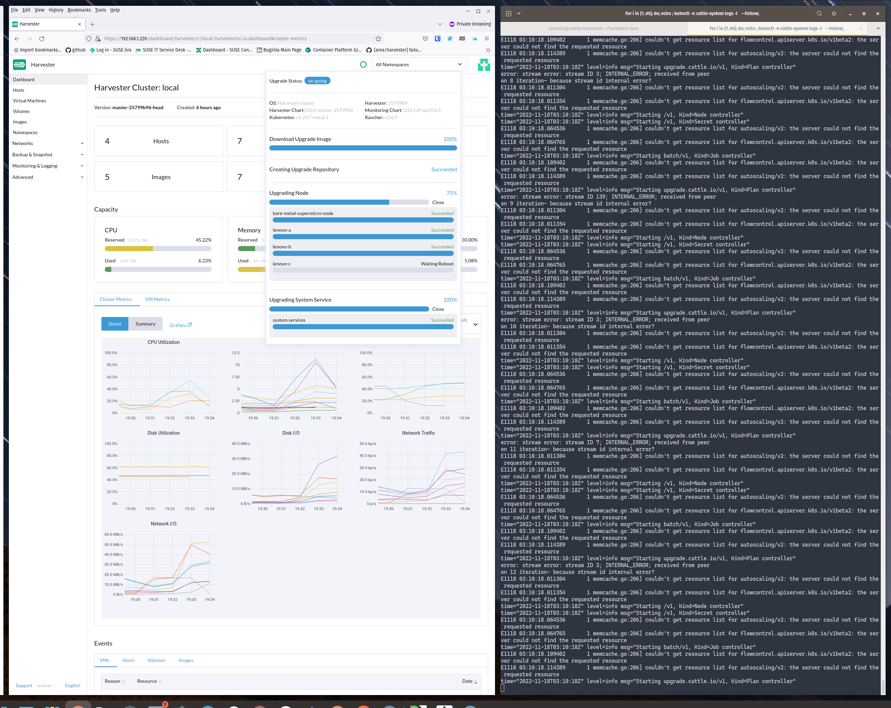

### Hardware

Quantity 1:
[supermicro xdrd9it+](https://www.supermicro.com/products/archive/motherboard/x9drd-it_)
SuperMicro Board: 2 Intel Xeon Processors, 32 Cores In Total
SuperMicro RAM: 64GB DDR3 ECC
1 300GB SATA3 SSD

Quantity 3:
Modded Lenovo ThinkCentre:
Intel Xeon E3-1265L v3 @ 2.50GHz
16GB DDR3 NON-ECC RAM
480GB Kingston SSD

### ScreenGrabs

